## ECE 212 - Project 1 - Fall 2026

### Introduction

**To download this repository to your home directory, run the following commands in a terminal or PowerShell:**

```
cd ~
git clone https://github.com/DougTownsend/ece212-project1.git
```

The purpose of this project is to get you familiar with breadboard, the Apio toolchain, and several Analog Discovery features. All code is provided for this project. In this project, you will set up the four buttons, eight LEDs, and two shift registers that we will use in projects 2 and 3. Since we will need more outputs than the Pico has available, we are using two shift registers for 16 of our outputs. We will cover shift registers in more detail later in the semester, but it is just a bunch of D flip flops connected together in series. This allows us to use one output pin for data, and another for clock. We then cycle through all the bits we want to output, and the bits are then shifted down on each positive clock edge. To avoid seeing the bits shifting into their desired positions, there is a second layer of D flip flops whose clock is the "strobe" signal. At the positive edge of the strobe signal, all outputs are updated with the contents of the shift register. Each shift register's QS1 connection can be chained into the data input of another shift register, allowing us to have as many outputs as we want from these three I/O pins, at the cost of those outputs not being as responsive. A block diagram of how this works is shown below.

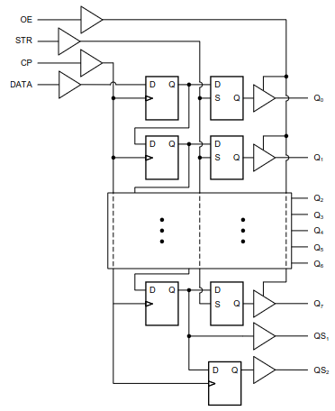

### FPGA vs Pico

I have provided two directories in this repository, `fpga` and `pico`. Open a terminal in the directory of whichever one you are using, and run `apio upload`. The biggest difference between the two is the clock source. The Pico is set up to have an internal 1kHz clock signal on "pin -1" but the FPGA has no internal clock. Instead, it has an external 12MHz oscillator. If you are using the FPGA, you will need to either put a jumper wire connecting the pins labelled `20` and `12M` or put a glob of solder to connect the pads labelled `OSC`. I have the FPGA code set up to have the top module be `real_main`, which has a clock divider that turns the 12MHz signal into a 1kHz signal and then feeds that signal into `main`. This allows both versions to use the same `main`. The image below shows both options, with the arrow pointing at the soldered connection.

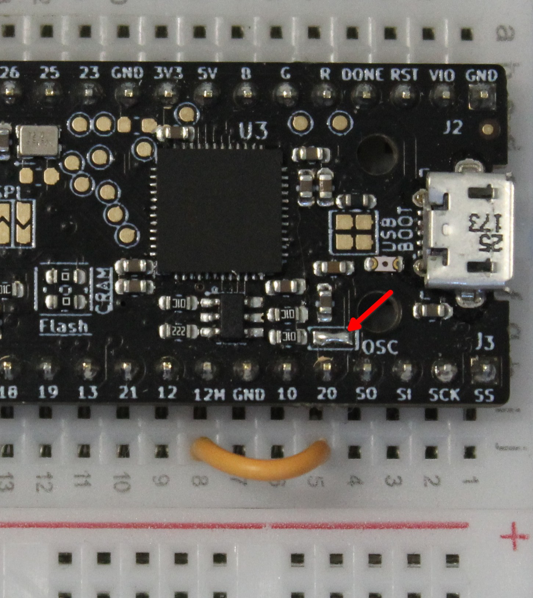

The other difference is the pin numbering. I will not include the pin numbers used in this document. Instead, see the `pins.pcf` file for whichever version you are using.

### Using a Breadboard

Breadboards are made up of numbered rows, lettered columns, and rails for power and ground. The rows are broken into two sections: a-e and f-j. Each of the holes within those sections is electrically connected. So putting a wire in position "a" and another in position "e" would connect those two wires. The power and ground rails are **typically** connected all the way down, **but some breadboards break the power and ground rails in half**. If the red and blue lines on your power and ground rails do not extend all the way across, the rails are likely broken into halves. The image below shows the bottom of a breadboard after the adhesive is removed.

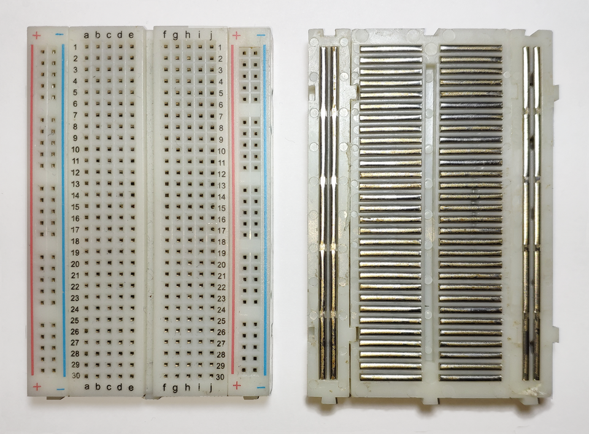

When putting components into breadboard, make sure they are fully pressed in. Failure to do so will result in a weak connection and potentially cause your circuit to not work. **When pressing in DIP packages, such as the shift register or the switches, make sure that ALL the pins are partially pressed into holes before you press it all the way in**. It is really easy to bend pins on DIP devices. If you bend a pin once, you can usually bend it back and try again, but each time you bend a pin, the odds of it breaking off when you bend it back increase significantly. When pressing in the Pico/FPGA, you will need to press quite hard, potentially using your body weight. The next two images show what the Pico looks like before and after being pressed in all the way.

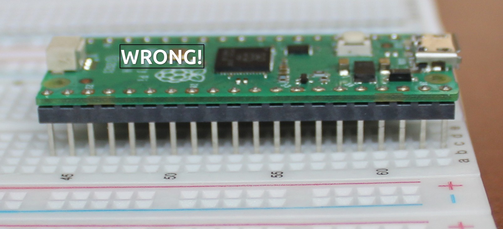

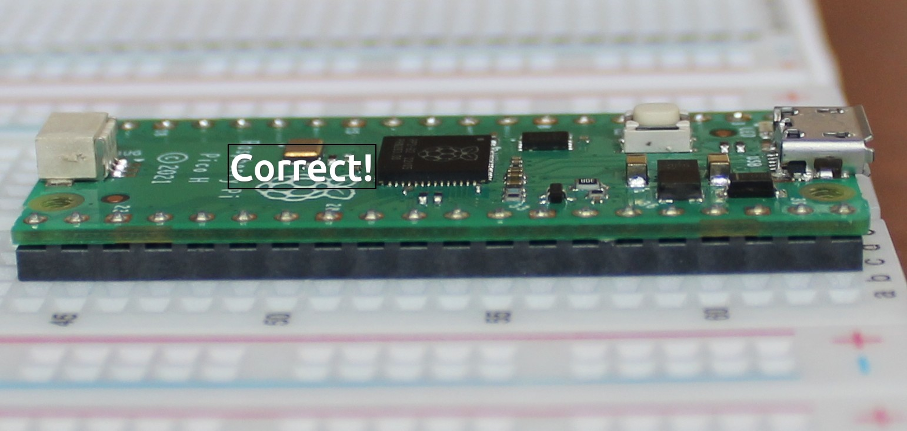

### Pin Numbers

While building the circuit, you will need to know what each pin does on the Pico and FPGA. The FPGA has a silkscreen that labels each pin number, but the Pico does not. The pinout for the Pico can be found at [pico.pinout.xyz](https://pico.pinout.xyz). The 3.3V pin is labeled `3V3` on both.

### Building the Circuit

For this project, I will show step-by-step pictures of the circuit, but in all projects after this one, you will only be given circuit schematics. The first step is to connect 3.3V from the Pico/FPGA to the power rail, and connect any of the ground pins to the ground rail. Then connect ALL the power rails to each other, and ALL the ground rails to each other. Make sure that you do not accidentally connect power to ground, as that will prevent your circuit from functioning and could potentially damage your Pico/FPGA.

We can now add the four buttons, the switches, and the first shift register. When putting the shift register into the board, be aware of which side the U-shaped notch is on. In the image below, you can see the pinout for the shift register. The U-shaped notch is on the end that has the circle in the image. **The shift register chip has a circle at the end opposite the U-shaped notch. That mark is from injection molding, and is NOT the circle shown in the image**. In the following images, the U will be on the right side of the chip, which puts pins 1-3 closest to the Pico/FPGA.

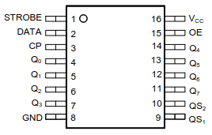

We will not be using the switches in this project, but put them there as a placeholder. When adding your buttons, make sure that the pins are each in a different row. The image below shows the breadboard up to this point.

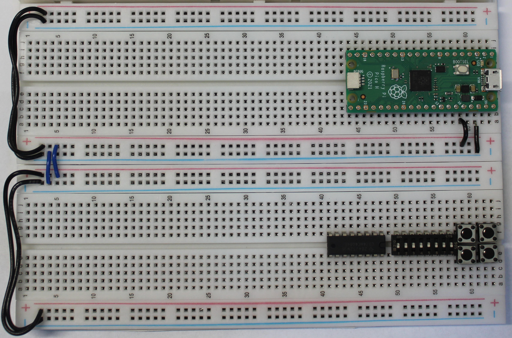

The shift register needs to be connected to power and ground, and its OE (output enable) pin needs to be connected to power. This is shown in the image below.

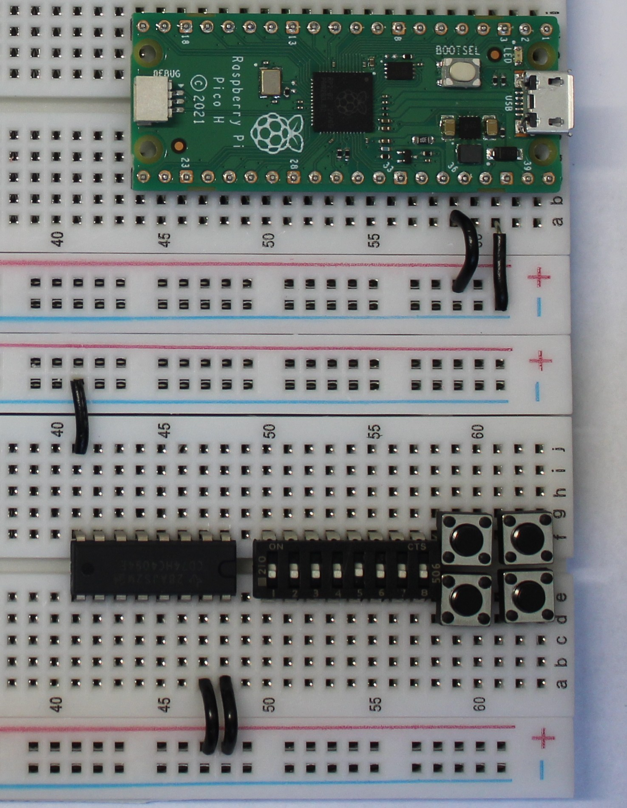

We will be using the shift registers to drive LEDs. We cannot connect LEDs directly to the outputs without possibly damaging the LEDs or the shift register, so we need to add **1kOhm** resistors on all the outputs. Each side of the shift register chip has 4 outputs. The image below shows how you can connect resistors from each output to a pin beside the chip. **Make sure to trim your resistors as shown in the image. Failure to do so will make your circuit extremely fragile, and will result in a large point deduction**.

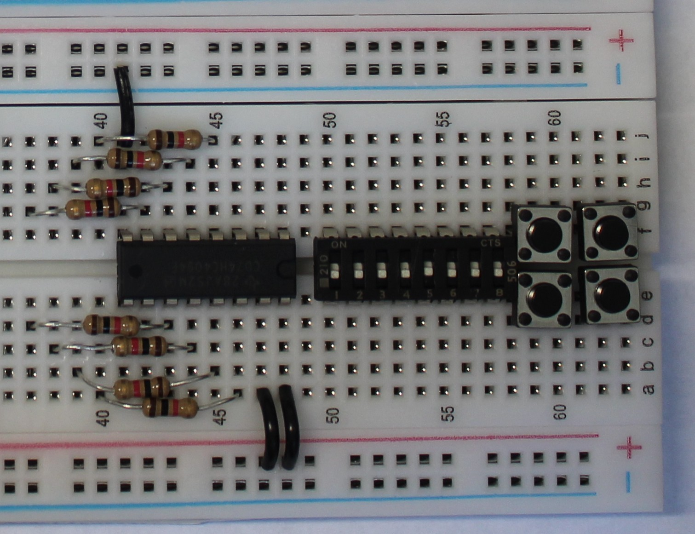

We can now add the LEDs next to where the resistors end. Trim the LEDs so that they do not stick up too high from the board. You can tell which side is positive or negative by looking for a flat spot or a notch on the plastic at the base of the LED. The pin that has the flat/notch is the negative side. In the following images, the negative pin is on the LEFT. If you try to put one LED per two rows on the breadboard, they will not fit. I leave a one-row gap between each pair of LEDs. See image below.

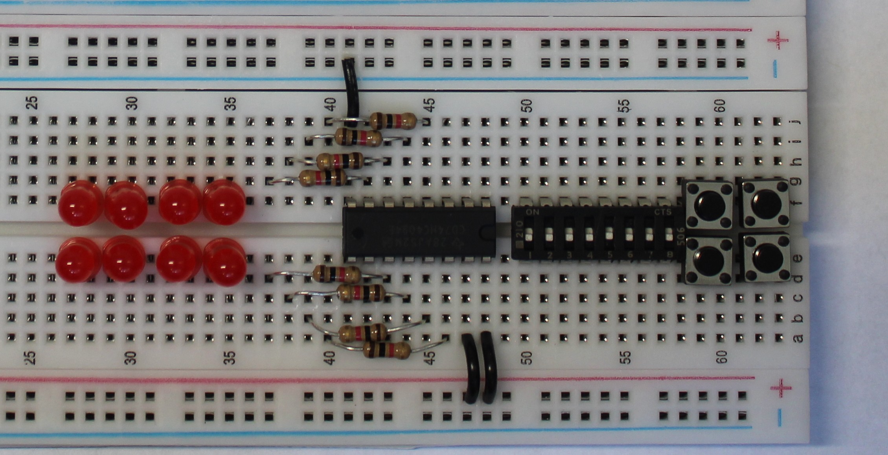

Now add the second shift register, exactly as you did the first one, to the left of the LEDs. **Due to my error in the parts list, you will not have enough 1kOhm resistors. Do not worry! I will buy enough for everyone! You can skip the resistors on this shift register for now!** See image below.

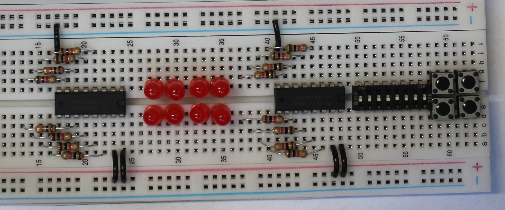

We will not be connecting anything else to the second shift register for this project, so we can now finish making all the needed connections for the parts we have. Start by adding the pull-down resistors between ground and one of the pins for each button. We will use **10kOhm** resistors for this. See image below.

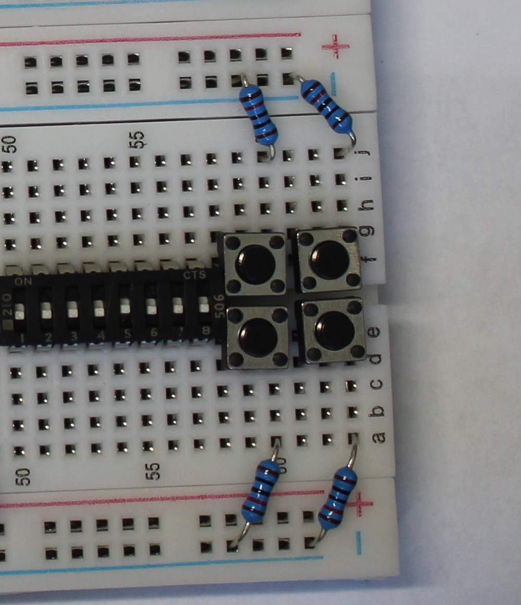

For each button, connect its other pin to power. See image below.

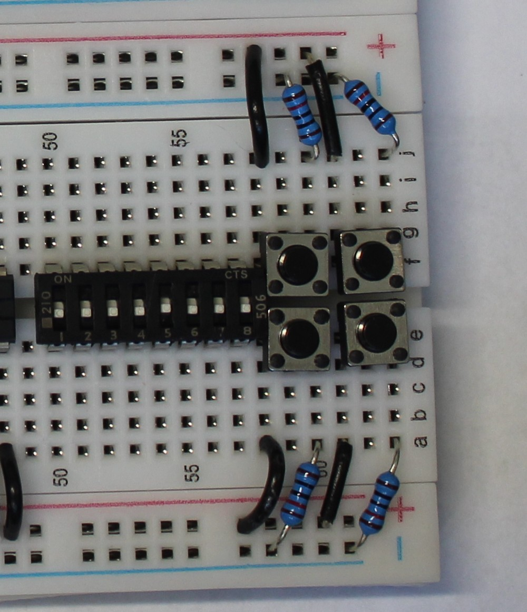

Now, for each button, connect the row that connects the resistor and the button to the button pins on your Pico/FPGA. See pins.pcf to see what pin number each button should connect to. `btn[0]` is the top left button, `btn[1]` is top right, `btn[2]` is bottom left, and `btn[3]` is bottom right. See image below.

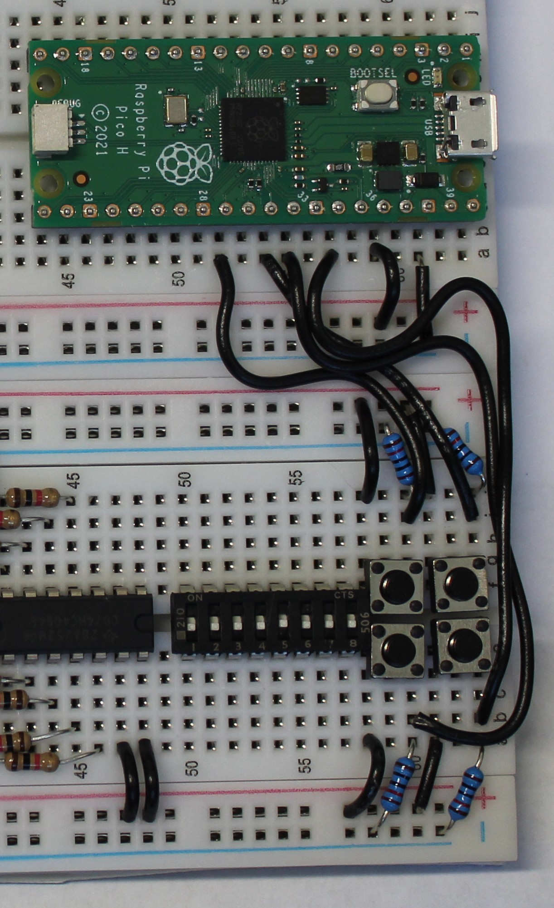

Now connect the first shift register's strobe, data, and clock pins (1-3) to the Pico/FPGA. See image below.

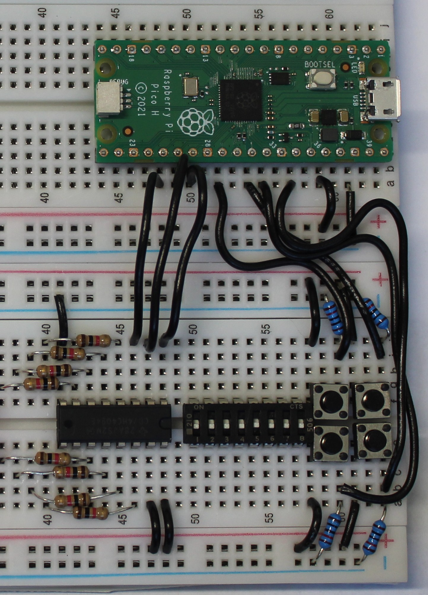

You then need to jump the strobe and clock signals from the first shift register to the second, then connect `QS1` (pin 9) from the first shift register to the data pin (pin 2) of the second shift register. See image below.

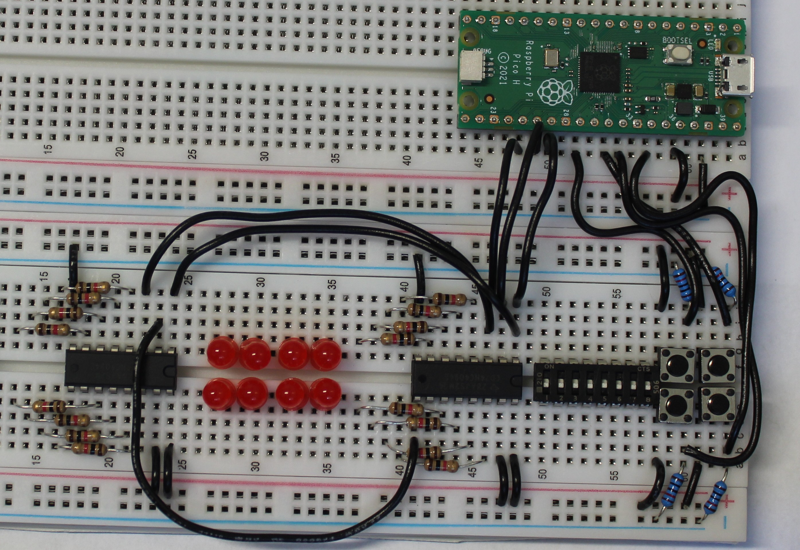

Now all that is left is finishing the LEDs. Start by connecting each LED's negative pin to ground. See image below.

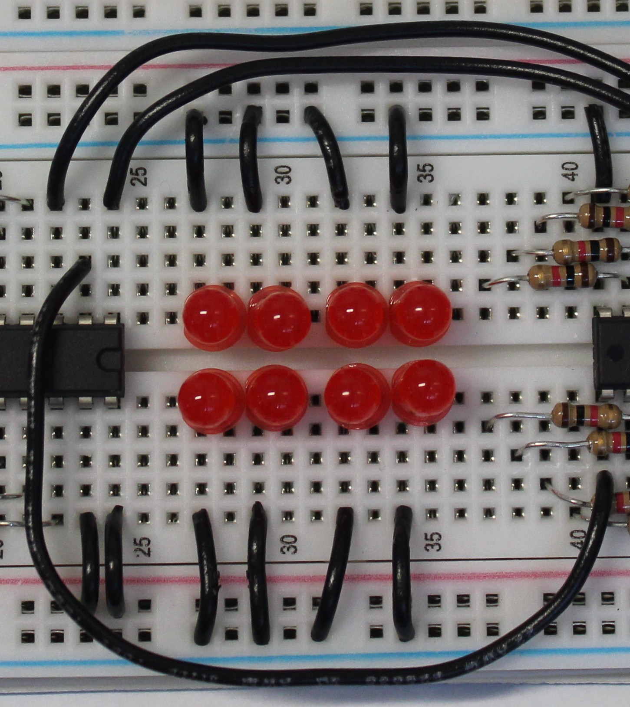

Now, connect the positive pin of each LED to one of the resistors connected to the shift register. Q3 should go to the top-left LED, Q0 to the top-right, Q7 to the bottom-left, and Q4 to the bottom-right. See image below.

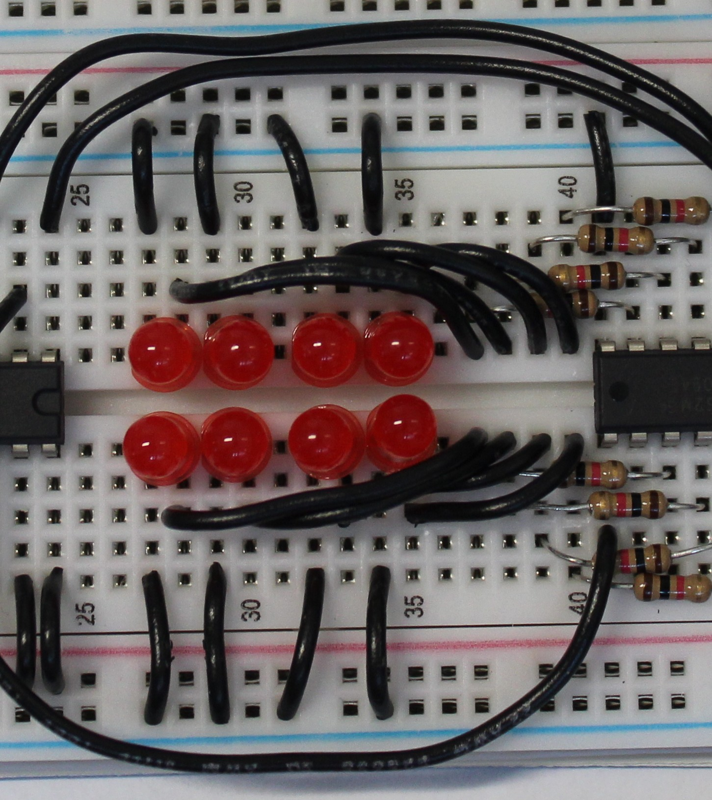

### Demo Procedure

You will press each button, and we will make sure that the four different patterns appear on the LEDs.

btn[0] : 1010 1111
btn[1] : 1111 1111
btn[2] : 0000 1010
btn[3] : 0000 1100

### Rubric

| Item | Points |
| --- | --- |
| Reasonable Attempt | 40 |
| Resistors Trimmed | 20 |
| Buttons Work | 20 |
| LEDs Work | 20 |
| Demo on or before 9/25 | 5 (Extra Credit) |


